# Project Udagram - Refactor Monolith to Microservices

## Overview

this project is part of Udacity's Cloud Developer ND

it consists of several microservices with links below:

https://github.com/albertsundjaja/udagram-feed
https://github.com/albertsundjaja/udagram-frontend
https://github.com/albertsundjaja/udagram-user
https://github.com/albertsundjaja/udagram-reverse-proxy

## Screenshots

### CICD Pipeline

##### Feed service

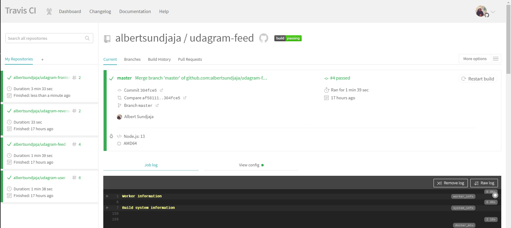
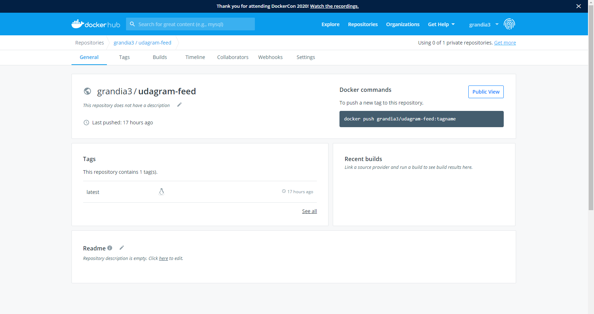

##### Frontend service

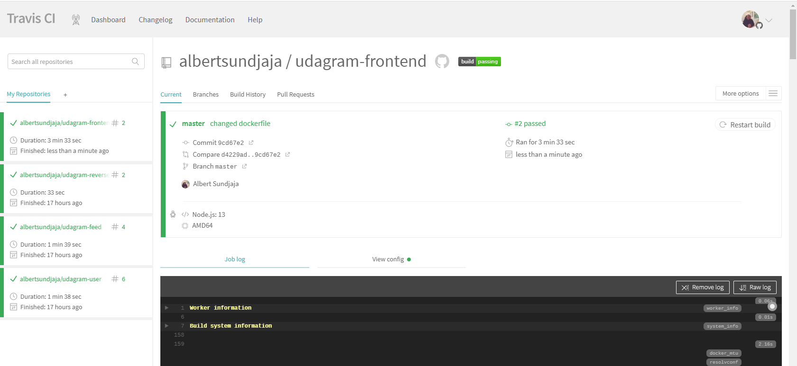
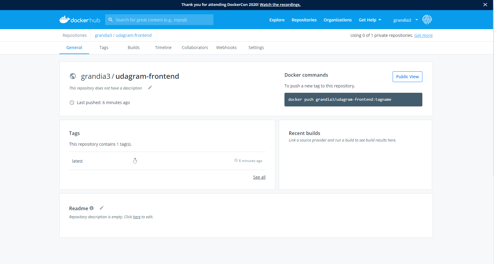

##### Reverse Proxy service

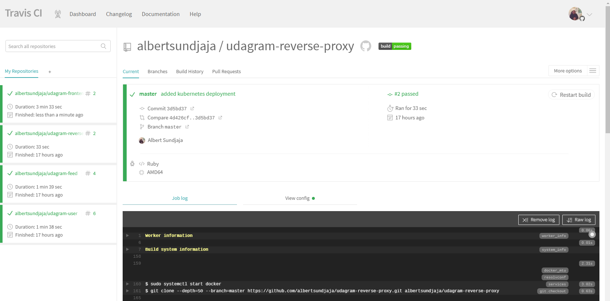

##### Frontend service

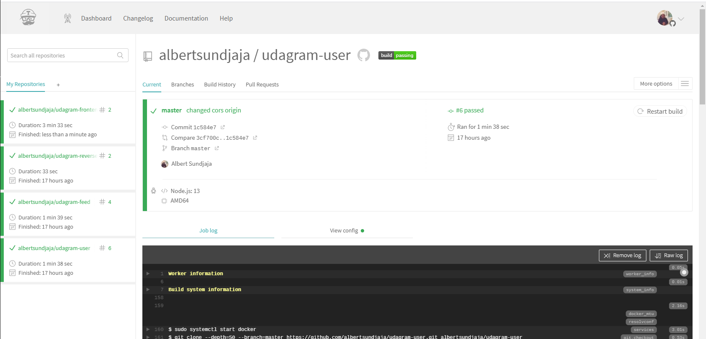
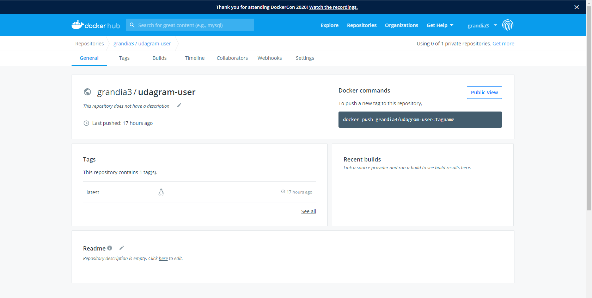

### Kubernetes

##### Get Pods

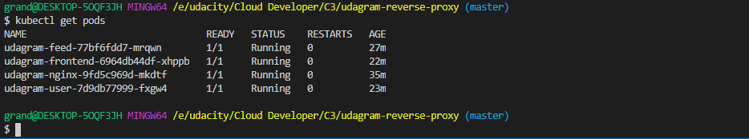

##### Describe Services

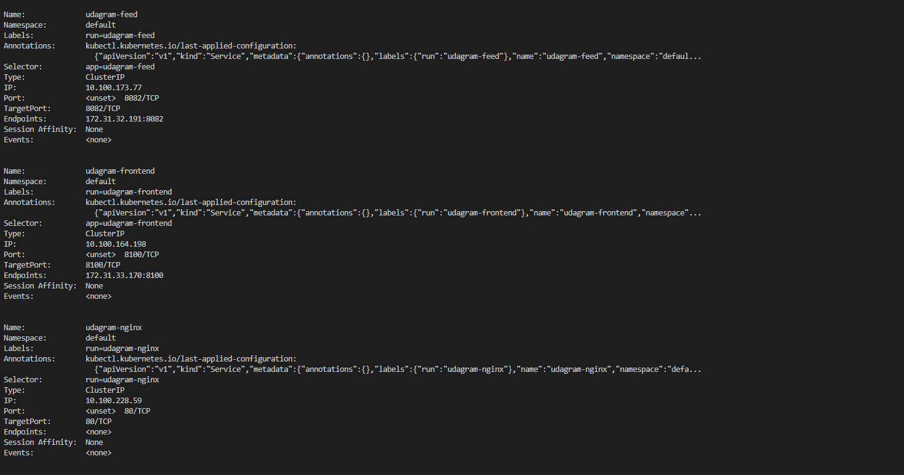
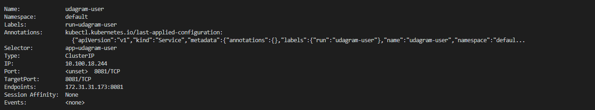

##### HPA

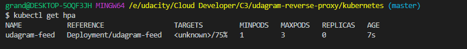
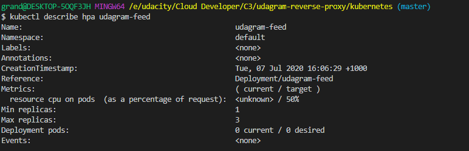

##### Logs

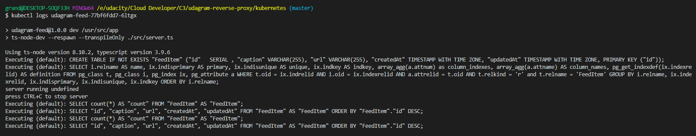